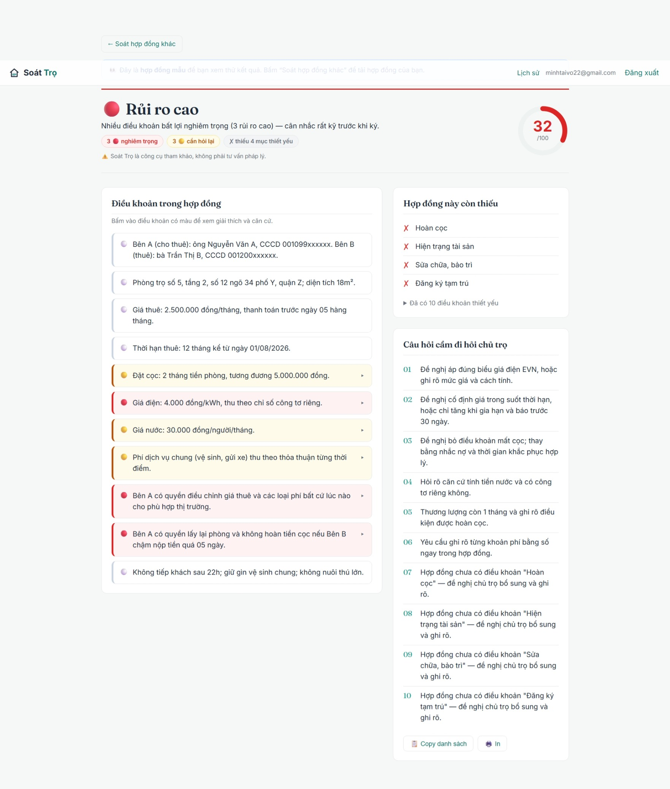

# 🏠 Soát Trọ

> AI soát hợp đồng thuê trọ: chụp/upload hợp đồng, ~30 giây sau biết điều khoản nào rủi ro (🔴🟡🟢), hợp đồng còn **thiếu** gì và nên hỏi lại chủ trọ câu nào — không cần gõ một chữ.

[](https://github.com/tai30052005/soat-tro/actions/workflows/ci.yml)
&nbsp;


**🌐 Dùng thử: [soat-tro.vercel.app](https://soat-tro.vercel.app)** — bấm *“Xem thử hợp đồng mẫu”* để xem kết quả ngay, không cần đăng nhập.

<sub>⏳ Backend chạy trên free tier (Render) nên lần mở đầu tiên có thể chờ ~50 giây để service khởi động lại; các lần sau nhanh.</sub>



> ⚠️ Soát Trọ là **công cụ tham khảo, không phải tư vấn pháp lý**.

## Mục lục

- [Bối cảnh](#bối-cảnh)
- [Tính năng](#tính-năng)
- [Công nghệ](#công-nghệ)
- [Kiến trúc AI](#kiến-trúc-ai)
- [Bắt đầu](#bắt-đầu)
- [Tài liệu API](#tài-liệu-api)
- [Biến môi trường](#biến-môi-trường)
- [Triển khai](#triển-khai)
- [Cấu trúc dự án](#cấu-trúc-dự-án)
- [Tác giả](#tác-giả)
- [Giấy phép](#giấy-phép)

## Bối cảnh

Người thuê trọ — nhất là sinh viên, người mới đi làm — thường ký hợp đồng mà không đọc kỹ, rồi mới phát hiện những điều khoản bất lợi: giá điện cao hơn quy định, mất cọc vô lý, chủ được đơn phương chấm dứt, tự ý tăng giá… Soát Trọ giúp phát hiện các rủi ro đó **trước khi ký**, chỉ từ một tấm ảnh chụp hợp đồng, và giải thích bằng ngôn ngữ dễ hiểu kèm căn cứ pháp lý.

## Tính năng

- **Đọc hợp đồng từ ảnh/PDF** — chụp điện thoại hoặc PDF nhiều trang đều được (JPG/PNG/WEBP/PDF), dùng Gemini Vision, không cần nhập tay.
- **Chấm điểm an toàn 0–100** kèm nhãn rủi ro (🔴 rủi ro cao / 🟡 cần làm rõ / 🟢 khá an toàn).
- **Soi từng điều khoản** và tô màu theo mức rủi ro, kèm giải thích + căn cứ pháp lý.
- **Checklist "hợp đồng còn thiếu gì"** — liệt kê các điều khoản thiết yếu bị vắng.
- **Câu hỏi gợi ý** để mang đi hỏi lại chủ trọ trước khi ký.
- **Hợp đồng mẫu 1-chạm** để xem thử kết quả mà không cần API key hay đăng nhập.
- **Tài khoản & lịch sử** (tuỳ chọn) — đăng nhập để lưu lại các lần soát.

## Công nghệ

| Lớp | Công nghệ |
|---|---|
| Backend | Spring Boot 3 (Java 17), Spring Security + JWT, Spring Data JPA, Flyway, Springdoc OpenAPI |
| Cơ sở dữ liệu | PostgreSQL |
| Frontend | React 19, Vite, React Router, Axios |
| AI | Google Gemini (Vision + phân tích văn bản) |
| Hạ tầng | Docker Compose, GitHub Actions (CI), Vercel + Render + Neon (triển khai miễn phí) |

## Kiến trúc AI

Pipeline 3 bước, trong đó bước quyết định độ tin cậy là **code thuần, không phải AI**:

```
Ảnh/PDF ─▶ [1] Gemini Vision: bóc tách điều khoản, phân loại vào TAXONOMY cố định (~16 loại)
        ─▶ [2] Gemini: phân tích từng điều khoản theo RUBRIC, mỗi nhận định BẮT BUỘC kèm trích dẫn nguyên văn
        ─▶ [3] Code thuần (KHÔNG dùng AI):
               • verify grounding : nhận định không khớp nguyên văn hợp đồng → loại (chống bịa)
               • checklist thiếu  : ô taxonomy trống → kết luận tất định
               • điểm an toàn     : công thức trọng số cố định (docs/rubric.md)
```

Ba quyết định thiết kế giúp kết quả **đáng tin và tái lập**:

1. **Taxonomy đóng (enum cố định).** Gemini chỉ được phân loại vào danh sách loại điều khoản có sẵn, không tự sinh loại mới → bài toán "hợp đồng thiếu gì" trở thành tất định.
2. **Grounding bắt buộc.** Mọi nhận định phải trích đúng nguyên văn; code đối chiếu lại với văn bản gốc, không khớp thì loại → chống ảo giác (hallucination).
3. **Chấm điểm bằng code, không bằng AI.** Điểm 0–100 do code tính theo công thức trọng số → cùng một hợp đồng luôn ra cùng điểm và giải thích được từng điểm trừ.

Căn cứ pháp lý (`law_ref`) cũng do **code** gắn từ bảng tra cứu đã kiểm chứng (`docs/rubric.md`), không để AI tự sinh.

## Bắt đầu

### Yêu cầu

- Docker & Docker Compose *(cách nhanh nhất)*, hoặc
- JDK 17 + Maven và Node.js 20+ *(nếu chạy dev từng phần)*
- Một `GEMINI_API_KEY` từ [Google AI Studio](https://aistudio.google.com/apikey) — tuỳ chọn; để trống thì tính năng AI tự tắt, vẫn xem được hợp đồng mẫu.

### Chạy bằng Docker Compose (đủ 3 service)

```bash
docker compose up --build
# Frontend: http://localhost:3001 — API: http://localhost:8081 — Postgres: localhost:5433
```

Đặt `GEMINI_API_KEY` qua biến môi trường (hoặc file `.env`, đã được gitignore) trước khi chạy nếu muốn dùng tính năng AI.

### Chạy dev từng phần

```bash
docker compose up -d db                    # chỉ Postgres
DB_PORT=5433 mvn spring-boot:run           # backend tại :8080
cd frontend && npm install && npm run dev  # frontend tại :5173 (proxy /api -> :8080)
```

### Kiểm thử

```bash
mvn test                        # backend: 54 test, chạy trên H2 in-memory, không cần Postgres
cd frontend && npm run build    # frontend: kiểm tra build
```

## Tài liệu API

Khi backend chạy, mở Swagger UI tại `/swagger-ui.html` (vd `http://localhost:8081/swagger-ui.html`).

| Method | Endpoint | Đăng nhập | Mô tả |
|---|---|:---:|---|
| `POST` | `/api/analyses` | không | Tạo phân tích từ ảnh/PDF (multipart, tham số `files`) |
| `GET` | `/api/analyses/sample` | không | Kết quả hợp đồng mẫu (không gọi Gemini) |
| `GET` | `/api/analyses/{id}` | không | Lấy kết quả theo id |
| `GET` | `/api/analyses` | token tuỳ chọn | Lịch sử soát (lọc theo người dùng nếu có token) |
| `POST` | `/api/auth/register` | không | Đăng ký tài khoản |
| `POST` | `/api/auth/login` | không | Đăng nhập, trả JWT |
| `GET` | `/api/health` | không | Health check |

## Biến môi trường

| Biến | Mặc định | Mô tả |
|---|---|---|
| `DB_HOST` | `localhost` | Host PostgreSQL |
| `DB_PORT` | `5432` | Cổng PostgreSQL |
| `DB_NAME` | `soattro` | Tên database |
| `DB_PARAMS` | *(trống)* | Tham số nối thêm vào URL, vd `?sslmode=require` cho Neon |
| `DB_USER` | `soattro` | User DB |
| `DB_PASSWORD` | `soattro` | Mật khẩu DB |
| `JWT_SECRET` | *(khoá dev)* | Khoá ký JWT (≥ 32 ký tự) — **bắt buộc đặt khi deploy** |
| `JWT_EXPIRATION_MS` | `86400000` | Thời hạn token (24 giờ) |
| `CORS_ALLOWED_ORIGINS` | *(các cổng localhost)* | Danh sách origin frontend được phép gọi API |
| `GEMINI_API_KEY` | *(trống)* | Khoá Google Gemini — để trống thì tính năng AI tự tắt |
| `GEMINI_MODEL` | `gemini-3-flash-preview` | Model Gemini dùng để đọc & phân tích |
| `PORT` | `8080` | Cổng HTTP của backend (Render tự cấp) |

> Bí mật (khoá Gemini, mật khẩu DB, `JWT_SECRET`) chỉ đặt trong dashboard từng nền tảng — **không commit vào repo**.

## Triển khai (miễn phí)

Bản đang chạy: Frontend [soat-tro.vercel.app](https://soat-tro.vercel.app) · Backend [soat-tro-api.onrender.com](https://soat-tro-api.onrender.com) · DB Neon Postgres 17.

| Thành phần | Nền tảng | Cấu hình |
|---|---|---|
| Database | **Neon** | Tạo project Postgres, lấy host/db/user/password |
| Backend | **Render** | Blueprint `render.yaml` (build từ `Dockerfile`); điền `DB_*`, `GEMINI_API_KEY`, `CORS_ALLOWED_ORIGINS` |
| Frontend | **Vercel** | Import thư mục `frontend/` (config `vercel.json`); đặt env `VITE_API_URL` = URL backend Render |

Các bước:

1. **Neon** — tạo database, tắt *connection pooling*, copy chuỗi kết nối.
2. **Render** — *New → Blueprint* trỏ vào repo. Điền `DB_HOST/DB_NAME/DB_USER/DB_PASSWORD` (từ Neon), `DB_PARAMS=?sslmode=require`, `GEMINI_API_KEY`, `CORS_ALLOWED_ORIGINS` = domain Vercel. `JWT_SECRET` để Render tự sinh.
3. **Vercel** — import `frontend/`, đặt `VITE_API_URL` = URL service Render (vd `https://soat-tro-api.onrender.com`), deploy.

## Cấu trúc dự án

```
soat-tro/
├── src/main/java/com/example/soattro/
│   ├── ai/          # gọi Gemini: bóc tách + phân tích điều khoản
│   ├── service/     # grounding verify, chấm điểm, checklist, căn cứ luật
│   ├── controller/  # REST API
│   ├── entity/      # taxonomy điều khoản, rubric, JPA entities
│   ├── security/    # JWT, Spring Security
│   └── ...          # config, dto, repository, exception
├── src/main/resources/db/migration/   # Flyway
├── frontend/        # React + Vite (pages, components, api)
├── docs/rubric.md   # taxonomy + rule rủi ro + căn cứ pháp lý
├── SPEC.md          # đặc tả & lộ trình chi tiết
├── Dockerfile · docker-compose.yml · render.yaml · vercel.json
```

## Tác giả

**Võ Minh Tài** — [GitHub](https://github.com/tai30052005)

## Giấy phép

Dự án cá nhân phục vụ mục đích học tập và trình diễn (portfolio). Vui lòng liên hệ tác giả trước khi sử dụng lại.
